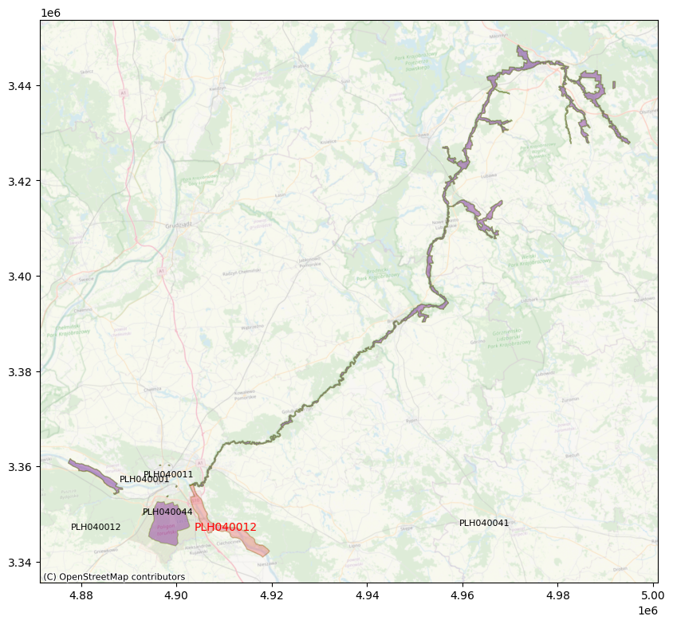

# NATURA9000

Playing with the Natura 2000 data

https://en.wikipedia.org/wiki/HAL_9000

## Setup

Created on a MacBook Pro

```
python3 -m pip install --upgrade pip
python3 -m pip install geopandas matplotlib contextily
```

```
brew install gdal
```

## Data

Go to https://www.eea.europa.eu/data-and-maps/data/natura-14

Click GIS Data

Download Natura 2000 - Spatial data

Natura 2000 End 2021 - Shapefile

Natura 2000 End 2021 - OGC Geopackage

Unzip Shapefile to folder `data`.

### Test

The `fid` is internal feature id in numeric format.

To write specific features to a test shapefile with limited number of features using `fid` to select:

```
ogr2ogr -lco ENCODING=UTF-8 -sql "SELECT * FROM Natura2000_end2021_rev1_epsg3035 WHERE fid IN (1,2,3,4,5,6,7,8,9,10)" data/test.shp data/Natura2000_end2021_rev1_epsg3035.shp
```

Write first x features to a test shapefile using fid:

```
ogr2ogr -lco ENCODING=UTF-8 -sql "SELECT * FROM Natura2000_end2021_rev1_epsg3035 WHERE fid < 1000" data/test.shp data/Natura2000_end2021_rev1_epsg3035.shp
```

FYI: to create spatial index on a Shapefile, `qix` is open source alternative for `shx`, not tested if geopandas uses either of these anyway so could skip this step. Also using geopandas `.sindex` but not assessed impact.

```
ogrinfo --config CPL_DEBUG ON -sql "CREATE SPATIAL INDEX ON Natura2000_end2021_rev1_epsg3035" data/Natura2000_end2021_rev1_epsg3035.shp
```

```
ogrinfo --config CPL_DEBUG ON -sql "CREATE SPATIAL INDEX ON test" data/test.shp
```

## Script

Python scripts

```
count_dbf_records.py

natura2000nearest.py

natura2000nearest_visualisation.py
```

## Run

```
python3 natura2000nearest.py

python3 natura2000nearest_visualisation.py
```

## Results

```
results/output.csv
```

Example visualisation of results:



## Todo

- Check 'geopandas only calculates planar distances, so with data in lat-long you will always get significant errors'. May need to convert to reproject to a projected (equidistant?) coordinate system to get better accuracy.

## Questions

Q:
Shapefile and OGC Geopackage. Can Geopandas handle both formats? Which one is faster?

## Notes

1.
Natura2000_end2021_rev1_Shapefile.zip 677 MB from https://www.eea.europa.eu/data-and-maps/data/natura-14

To find out that again real life is bit more  complex. The data is in `EPSG:3035 - ETRS89-extended`, so should be reprojected to `EPSG:4326 - WGS84` for databases that only support WGS84 (like GraphDB, MongoDB, note that MarkLogic does support ETRS89). Be aware that both EPSG 3035 and 4326 are in decimal degrees, so will load into databases with WGS84 support. Maybe calculations sometimes even do produce the same results without reprojection, but that would not be the right way.
Reprojecting to EPSG:4326 - WGS84

You can reproject with `ogr2ogr`

```
ogr2ogr -f "ESRI Shapefile" Natura2000_end2021_rev1_epsg4326.json -s_srs EPSG:3035 -t_srs EPSG:4326 Natura2000_end2021_rev1_epsg3035.shp
```

2.
Looks like the source data already has 4 decimals only, need to doublecheck. If that is the case then useful to check if possible to limit number of decimals in or when loading into a database, or maybe the Shapefile to RDF triples tool does that?

`COORDINATE_PRECISION` is not supported for Shapefile, can be used with geojson but as said maybe not necessary, check source data decimals first.

Check this Shapefile to RDF tool: https://geotriples.di.uoa.gr/, and/or this one https://github.com/SLIPO-EU/TripleGeo

## Links

https://mapshaper.org/
